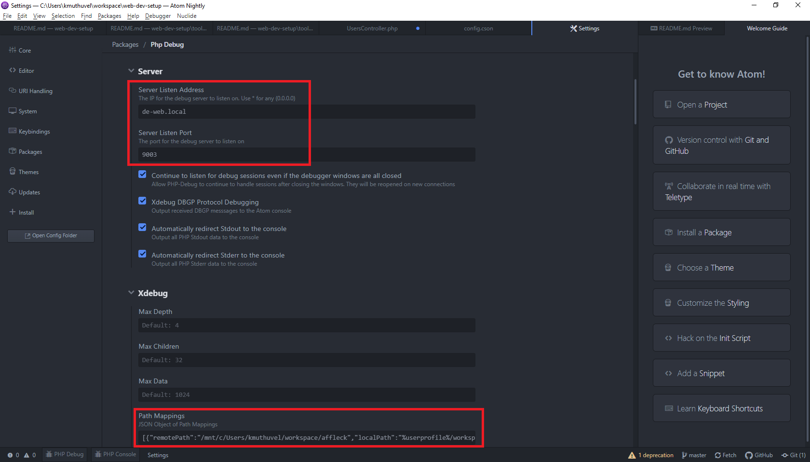
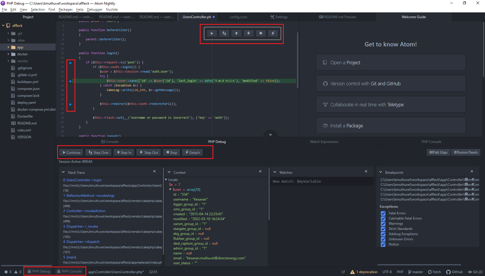

### ATOM Editor

#### Key files
- Init Script `File >> Init Script | init.coffee`  _hold global config at editor level_
- Config &nbsp; &nbsp; &nbsp;`File >> Config  | config.json`      _hold additional configs for editor & plugins_

##### GitHub connectivity
In case you encounter errors connecting GitHub, ensure `%userprofile%\.ssh` folder on  has the following all 3 files with right permission:
`id_rsa`, `id_rsa.pub` & `known_hosts`

##### Atom.io connectivity
When attempt to install plugins/themes, if you encounter errors related to `SELF_SIGNED_CERT_IN_CHAIN`, try:

`File -> Settings -> init.coffee`
```
ssl=false
process.env.NODE_TLS_REJECT_UNAUTHORIZED = 0
```
You may need to restart the Network as well ATOM editor itself

Also try executing `apm config set strict-ssl false` on `cmd` terminal when ATOM is running!


##### Multi Instances
**Running different flavor(version) as another instance** Sometime you may need to run multi instances of ATOM or it's different flavor with it's own profile & settings. To acheive this on Windows modify the `<ATOM_FLAVOR>.cmd` file located at  `%USERPROFILE%\AppData\Local\<ATOM_FLAVOR>\bin\`:

_Sample content :_

```
  @echo off
  set "ATOM_HOME=%USERPROFILE%\AppData\Roaming\<ATOM_FLAVOR>"
  "%~dp0\..\app-1.63.0-nightly1\resources\cli\atom.cmd" %*
```

Run `ATOM_FLAVOR` from `cmd` terminal by:
  - `cd  %USERPROFILE%\AppData\Local\<ATOM_FLAVOR\bin>`  _# go to the ATOM_FLAVOR bin  dir_
  - `<ATOM_FLAVOR>.cmd`                                  _# execute the ATOM_FLAVOR bin_


#### Recommended plugins

These packages(plugins) recommended for web development focused on PHP environment.

Package| Source |Author| Notes|
--|--|--|--|
[ide-php](atom/ide-php)|`atom/ide-php`|atom|--|
[atom-ide-ui](facebook-atom/atom-ide-ui)|`facebook-atom/atom-ide-ui`|facebook-atom|
[minimap](atom-minimap/minimap)|`atom-minimap/minimap`|atom-minimap|
[minimap-split-diff](mupchrch/minimap-split-diff)|`mupchrch/minimap-split-diff`|mupchrch|
[split-diff](mupchrch/split-diff)|`mupchrch/split-diff`|mupchrch|
[atom-html-preview](harmsk/atom-html-preview)|`harmsk/atom-html-preview`|harmsk|


#### xDebugging

Install the following packages

Package| Source |Author| Notes|
--|--|--|--|
[atom-debug-ui](cchamplin/atom-debug-ui)|`cchamplin/atom-debug-ui`|cchamplin|
[php-debug](gwomacks/php-debug)|`gwomacks/php-debug`|gwomacks|


PathMapping
Refer the below for `config.cson`


```javascript
"php-debug":
  server:
    keepAlive: true
    protocolDebugging: true
    redirectStderr: true
    redirectStdout: true
    serverAddress: "de-web.local"
    serverPort: 9003
  showWelcome: false
  xdebug:
    pathMaps: "[{\"remotePath\":\"/mnt/c/Users/kmuthuvel/workspace/affleck\",\"localPath\":\"C:/Users/kmuthuvel/workspace/affleck\"}]"

```

##### Mapping example


##### Debugging

