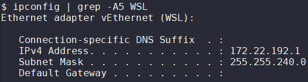
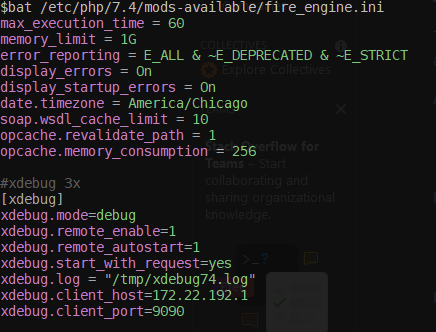
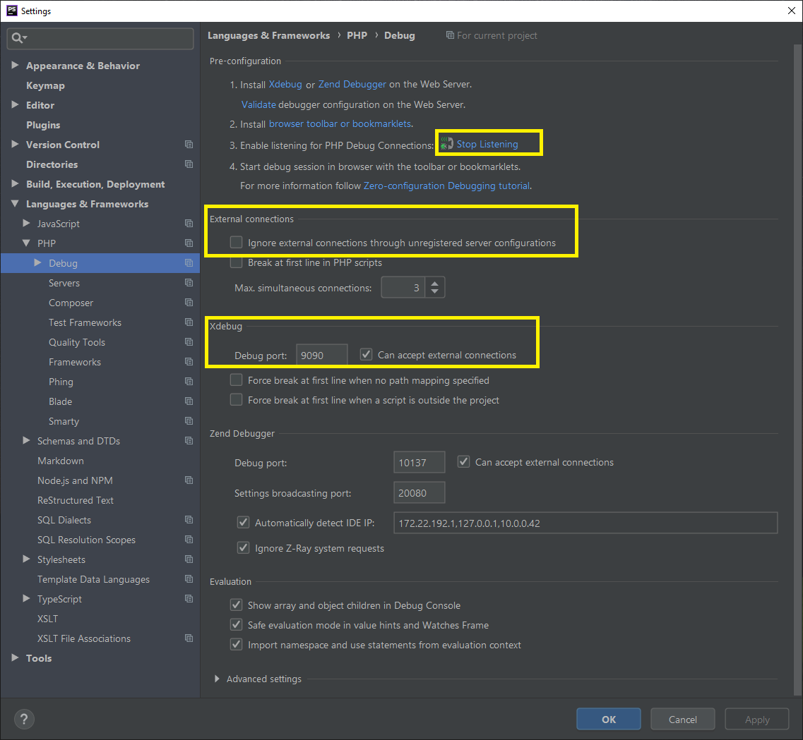
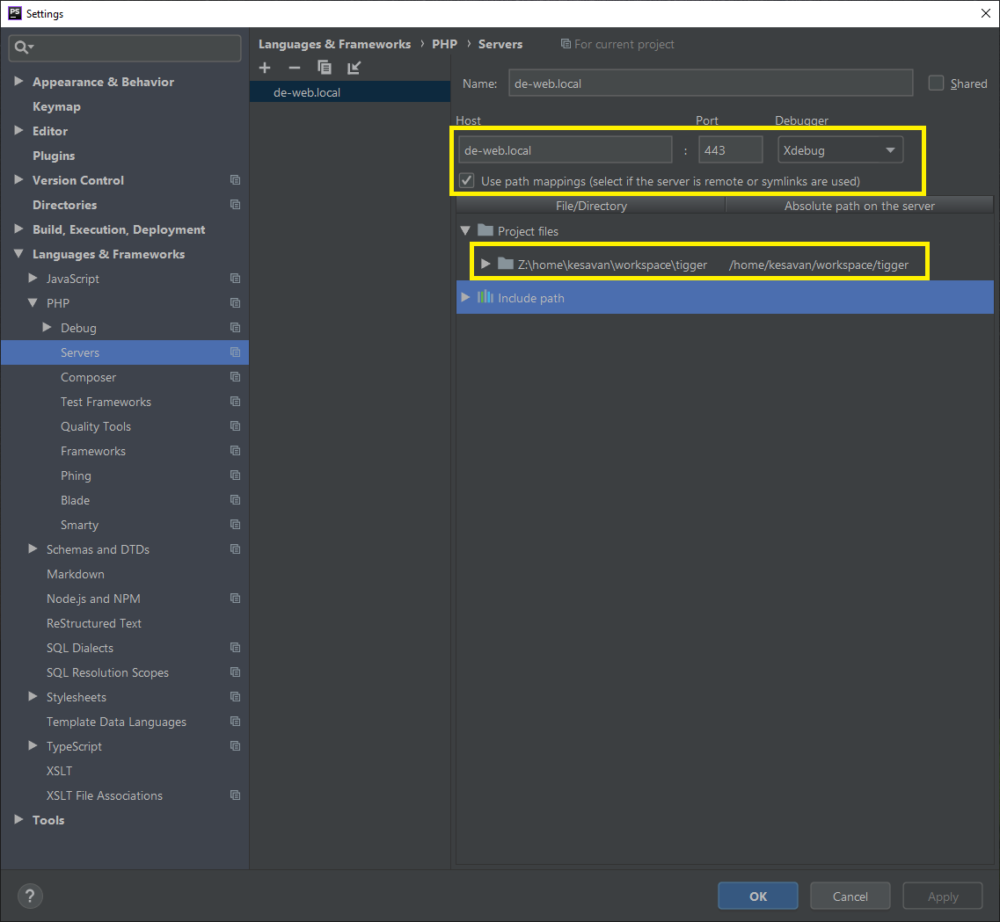
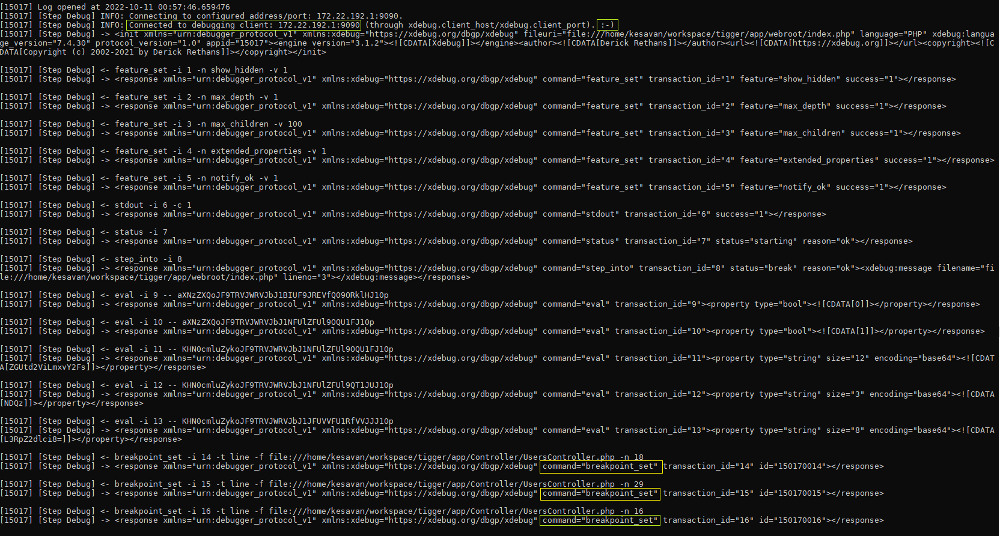

### Setup XDebug3 on WSL2


#### Find the right IP
*WSL2* comes with couple of feature and certain amount of issues with networks and the PHPSTORM likely not work with XDEBUG as expected. Finding the right IP of the remote server (where the apache resides) is one of key task in this setup. On the client side (where PHPSTORM/IDE runs), open `Command prompt`  or `GitBash` and use `ipconfig` command to identify the WSL's IP. Here is the command to fire on `GitBash` :
```bash
$ ipconfig | grep -A5 WSL
Ethernet adapter vEthernet (WSL):

   Connection-specific DNS Suffix  . :
   IPv4 Address. . . . . . . . . . . : 172.22.192.1
   Subnet Mask . . . . . . . . . . . : 255.255.240.0
   Default Gateway . . . . . . . . . :
```


#### Apache config
Refer the settings below configs. Use the standard port number 9003 wherever possible. The settings ideally located on `/etc/php/XXX/mods-available/xdebug.ini` where `XXX` is the PHP version



#### Host Entry
Make sure the `/etc/hosts` on WSL2 (REMOTE) as well as `C:\Windows\System32\drivers\etc\hosts` on Windows (CLIENT) has the IP from above mapped to `localhost`
```
172.22.192.1    localhost
127.0.0.1       de-web.local
::1             de-web.local
 ```

#### IDE settings
1. Start the listener
2. Uncheck the `Ignore external connections` option under *External connections* section
3. Ensure right port# and check to accept the external connections





#### Browser tweak
Install `Xdebug helper` on (Mozilla based) Firefox and enable the `Debug`. Incase of other browsers , try with similar plugins or bookmarklets

#### Network connectivity
- Always make sure Internet/network available to server where apache runs (WSL2)
- In case of issue still with XDebug connectivity, **disconnect VPN**
#### Happy debugging
If need, watch and monitor the debug file  `xdebug.log = "/tmp/xdebug74.log"` as mentioned on [Apache config](#apache-config) section above! 



Look out for the incoming connection on the IDE & Happy Debugging!

### Debugging inside VPN
- Use the `IPv4 Address` from VPN connection using `ipconfig` on Windows
- Update that above IP across the `hosts` on both Windows/WSL2
- Also update the IP on both `ini` and ensure it's in PHPStorm
- You may need `service apache2 restart` & IDE restart
- Wait for a 5-10 minutes, so the network changes will reflect in WSL2 env