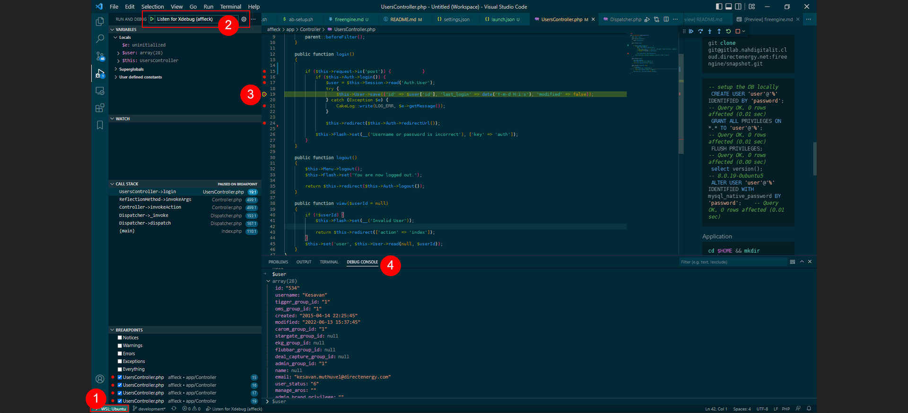

#### Codium/VS Code/VSCode Insider

|Version| Quick Intro|
|--|---|
|Codium| Fully opensource editor. Entire source avail to public|
|VS Code| Microsoft branded opensource. May send your usage and other data to MS|
|Code Insider| Beta version of VS Code|

#### Sync settings ####

Ensure you sync the settings using Github and Microsoft account so you can preserve your config across devices and platforms
Refer the distributed sample [settings.json](settings.distro.json) from my local config.

#### WSL support ####

WSL2 is recommended. May need to config the PHP and other lib path from WSL so that VSCode use them for syntax checking and basic processing. Refer how to use a `vscode-php.bat` from the appendix of [settings.json](settings.distro.json)

#### Key extensions ####

Here goes my list of installed extensions. Not in any order, just alphabetical.

```
UI/Themes
    harryhopkinson.vim-theme
    pkief.material-icon-theme
    zhuangtongfa.material-theme

Tweaks
    jerrygoyal.shortcut-menu-bar    
    howardzuo.vscode-favorites
    kdcro101.favorites
    nick-rudenko.back-n-forth
    oleg-shilo.favorites
    sketchbuch.vsc-zen-terminal-button
    wraith13.zoombar-vscode

Productivity    
    alefragnani.bookmarks
    bierner.markdown-checkbox
    mdw.vscode-todo-plus-plus
    usernamehw.todo-md

PHP/xDebugging
    bmewburn.vscode-intelephense-client
    devsense.phptools-vscode-1.13.10390-win32-x64
    sophisticode.php-formatter
    xdebug.php-debug
    xdebug.php-pack
    zobo.php-intellisense

GIT
    mhutchie.git-graph
    eamodio.gitlens
    pomber.git-file-history

RDBMS drivers(MySQL)
    cweijan.vscode-mysql-client2
    mtxr.sqltools
    mtxr.sqltools-driver-mysql
    formulahendry.vscode-mysql

Dockers/Remote/WSL
    ms-azuretools.vscode-docker
    ms-vscode-remote.remote-containers-0.245.2/
    ms-vscode-remote.remote-ssh
    ms-vscode-remote.remote-ssh-edit
    ms-vscode-remote.remote-wsl

Markdown
    shd101wyy.markdown-preview-enhanced
    yzhang.markdown-all-in-one

MISC
    hbenl.vscode-test-explorer
    hyunkyunmoon.gzipdecompressor
    ms-vscode.test-adapter-converter
    vscodevim.vim
```

## **xDebugging** ##
This assumes you run the code from WSL2

### **Server side**

- [X]  Update `#/etc/php/7.4/mods-available/my-wow-project.ini` or similar
  ```bash
    #xdebug 3x
    [xdebug]
    xdebug.mode=debug
    xdebug.remote_enable=1
    xdebug.remote_autostart=1
    xdebug.start_with_request=yes
    xdebug.remote_port=9003
    xdebug.log = "/tmp/xdebug74.log"
    # Note - the following are excluded : xdebug.remote_host & xdebug.client_host
  ```
- [X] Restart the web server : `sudo service apache2  restart`
- [X] Check with `phpinfo();` to see the above changes reflected!

### **Client side**

- [X]  Install & Enable the following extensions:
  * [Remote - WSL](https://marketplace.visualstudio.com/items?itemName=ms-vscode-remote.remote-wsl) ( Identifier: `ms-vscode-remote.remote-ws`)
  * [PHP Debug | v1.27.0](https://marketplace.visualstudio.com/items?itemName=xdebug.php-debug)  (Identifier: `xdebug.php-debug`)

- [X] Run the editor from WSL2

    ```bash
    which code      #  or which code-insiders - should return valid path from Windows Host - bin/code
    cd ~/workspace
    code my-wow-project    # or code-insiders <repo>
    ```
- [X] Config extension
```javascript
     //.vscode/launch.json content
    "configurations": [
        {
            "name": "Listen for Xdebug",
            "type": "php",
            "request": "launch",
            "port": 9003,
            "hostname": "de-web.local"
        },
```

### **Browser (Example: Firefox)**
1. Install extension - [xdebug-helper-for-firefox](https://addons.mozilla.org/en-US/firefox/addon/xdebug-helper-for-firefox/) and enable debugging
1. Press F5 in the VSCODE after setting breakpoints on the source
1. Load the page in browser. XDEBUG should trigger the breakpoints.


