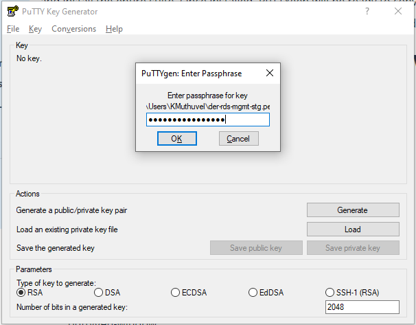
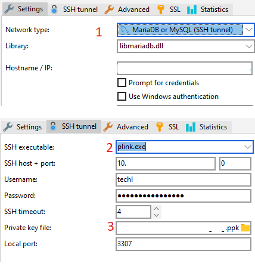

## **SQL Clients and Connections**

Here we about to see how to connect various SQL tools (SQL clients) to servers across multiple platforms supporting the applications


**RDBMS**
- MySQL
- Oracle
- MS SQL

**SSH Tunneling**
Often we may need to tunnel via another server to access the rdbms service & this called as tunneling. Most modern clients offer SSH Tunneling out-of-the-box. 

**1/2 - Command line tools**
If you've GNU/Linux (or WSL) you can configure locally to access the externally hosted servers by installing lib & tools on the linux OS.


- MySQL service
  - Use `mysql` client tool supplied along the mysql package.
  - Syntax : `mysql -h host -uusername -p` Make sure `host` is pingable
- MS SQL service
    - Installation
        ```bash
        sudo apt-get install unixodbc tdsodbc
        sudo su
        curl https://packages.microsoft.com/keys/microsoft.asc | apt-key add -
        curl https://packages.microsoft.com/config/ubuntu/18.04/prod.list > /etc/apt/sources.list.d/mssql-release.list     #Ubuntu 18.04
        exit
        sudo apt-get update
        sudo ACCEPT_EULA=Y apt-get install msodbcsql17

        sudo ACCEPT_EULA=Y apt-get install mssql-tools                   # optional: for bcp and sqlcmd
        echo 'export PATH="$PATH:/opt/mssql-tools/bin"' >> ~/.bash_profile
        echo 'export PATH="$PATH:/opt/mssql-tools/bin"' >> ~/.bashrc
        source ~/.bashrc
        sudo apt-get install unixodbc-dev                                # optional: for unixODBC development headers
        ```
    - Configuration
        ```bash
        $cat /etc/odbc.ini
        [rtpwdbpvcdw01]
        Driver = ODBC Driver 17 for SQL Server
        Description = CDW production
        Trace = Yes
        Server = 10.157.XXX.XXX,1433
        Database = DER_DW

        $cat /etc/odbcinst.ini
        [ODBC Driver 17 for SQL Server]
        Description=Microsoft ODBC Driver 17 for SQL Server
        Driver=/opt/microsoft/msodbcsql17/lib64/libmsodbcsql-17.5.so.2.1
        UsageCount=1
        ```


    - Testing
        ```bash
        $isql -v rtpwdbpvcdw01 DERDW_BNCE_RO  XXX
        +---------------------------------------+
        | Connected!                            |
        |                                       |
        | sql-statement                         |
        | help [tablename]                      |
        | quit                                  |
        |                                       |
        +---------------------------------------+
        SQL> quit
        ```


- Oracle service
  - installation
    ```bash
    $ls -l instantclient-basic-linux.x64-19.6.0.0.0dbru.zip instantclient-odbc-linux.x64-19.6.0.0.0dbru.zip  #a download the drivers from Oracle official site
    -rwxrwxrwx 1 kmuthuvel kmuthuvel  72M May 22 15:10 instantclient-basic-linux.x64-19.6.0.0.0dbru.zip
    -rwxrwxrwx 1 kmuthuvel kmuthuvel 624K May 22 13:49 instantclient-odbc-linux.x64-19.6.0.0.0dbru.zip
    $sudo unzip ~/Downloads/instantclient-basic-linux.x64-19.6.0.0.0dbru.zip -d /usr/lib                     #b extract them to /usr/lib
    $sudo unzip ~/Downloads/instantclient-odbc-linux.x64-19.6.0.0.0dbru.zip -d /usr/lib
    $export LD_LIBRARY_PATH=$LD_LIBRARY_PATH:/usr/lib/instantclient_19_6                                        #c update lib path
    ```


  - configuration
    ```bash
    $cat  /etc/odbc*ini
    [rtpwdbpvcdw01]
    Driver = mssql
    Description = CDW MI
    Trace = Yes
    Server = 10.157.XXX.XXX,1433
    Database = DER_DW

    [rtpwdbpvrbc09]
    Driver = mssql
    Description = CDW OAM
    Trace = Yes
    Server = 10.157.XXX.XXX,1433
    Database = OAM

    [rtpldbpvmis01]
    Driver = oracle
    Description = MIS HA production
    ServerName = //10.157.XXX.XXX:1540/SHRMISPRD1.na.XXXX.corp

    $cat /etc/odbcinst.ini
    [mssql]
    Description=Microsoft ODBC Driver 17 for SQL Server
    Driver=/opt/microsoft/msodbcsql17/lib64/libmsodbcsql-17.5.so.2.1
    UsageCount=1

    [oracle]
    Driver=/usr/lib/instantclient_19_6/libsqora.so.19.1
    Description=Oracle Instant Client ODBC Driver 19.1
    ```
  - Testing
    ```bash
    $isql -v -n rtpldbpvmis01 DIGITAL XXX'
    +---------------------------------------+
    |Connected!                             |
    |                                       |
    | sql-statement(s[;]                    |
    | go                                    |
    | ...                                   |
    | \columns                              |
    | \quit                                 |
    |                                       |
    +---------------------------------------+
    SQL> quit
    $
    ```

**2/2 - Third Party Clients**
- NaviCat   - Need license
- HeidiSQL  - Open source, portable
- Toad
- Oracle
- SQL Developer - Require `jre`
- DBeaver
- LINQPad   - Require `.Net` 
- MySQL WorkBench- Open source
- Microsoft SQL Server Management Studio (SSMS) 
- SquirrelSQL  - Open source, portable but require `jre`

**Support**


Support|MySQL|Oracle|MS SQL
|---|--|--|--|
NaviCat|Yes|--|--|
HeidiSQL|Yes|--|Yes|
SQL Developer||--|Yes|
Toad|Yes|Yes|--|
LINQPad|Yes|Yes|--|
DBeaver|Yes|--|--|
Oracle||Yes|--|
MySQL WorkBench|Yes|--|--|
Microsoft SQL Server Management Studio (SSMS) ||--|Yes|

---

**SSH Tunneling**
SSH Tunneling requires the following pre-requestie (MySQL scenario):

- Tunneling server's creds
- MySQL service's creds
- `ppk` file ( if applicable)


##### PPK generation

- Generate PPK from PEM - Use `PuTTY Key Generator` tool on `Windows`
  - Load the PEM file. You may need the password to unlock the `pem` file
  - Upon success, it'll populate the SSH Key & Fingerprint along with other info.
  - `Save Private Key` to store the `ppk` file
  
  

- On `GNU/Linux` side, try `sudo puttygen pemKey.pem -o ppkKey.ppk -O private`

##### Tunneling with Client

- Use it on PuTTY or SSH Tunneling tools (Eg.: MySQL Clients)
- Most modern tools offer SSH tunnel in their settings/options
- In general, choose type as `SSH tunnel` , `plink` as SSH tool and ensure `ppk` loaded as private key.
- Refer below for `HeidiSQL` client
  



