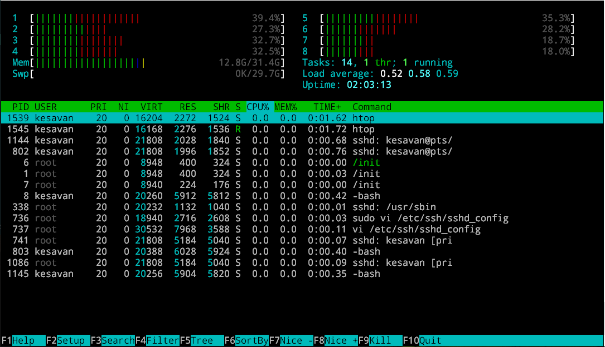
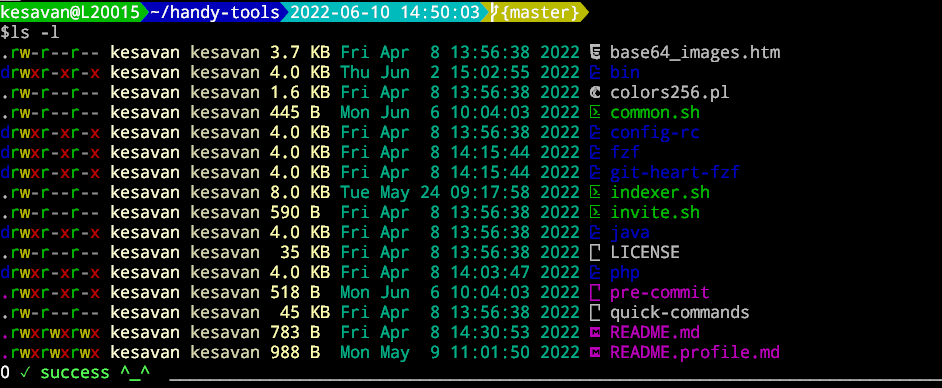
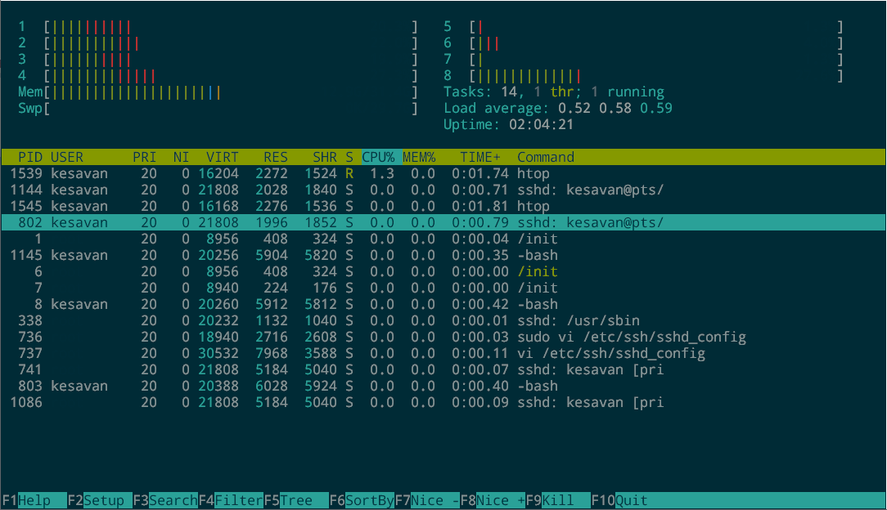

### Terminals

#### Themes & Fonts

- **Theme** - I always recommend `solarized`(dark mode) theme wherever applicable.
 - Try install [solarized_dark.reg](https://github.com/altercation/solarized/blob/master/putty-colors-solarized/solarized_dark.reg). If there's no admin right on Windows, exeute this a normal user: `reg import solarized_dark.reg`. PuTTY will be loaded with the theme.

- **Fonts** - The following two fonts are choice which appears more modern as well eye-candy.
    - DroidSansMono Nerd Font
    - DejaVu Sans Mono for Powerline

##### Default theme

##### solarized (dark) theme

#### Friendly terminals

- `PuTTY` - every developers first & must have SSH client to connect to remote server
- `Git Bash` - If there's Git flow on your work, Git bash is life saver. Comes with basic Gnu utilites making you feel in right enviroment. Also used to execute Windows native commands as well as to connect to `dockers`
- `WSL terminal` - This gives access to the WSL where te project most likely lives.
- `Tabby` - Earlier called as `Terminus` , a modern console which can replace all the above. This tabbed terminal let you have as many terminals as need. It can connect to remote SSH, WSL, PowerShell, Command Prompt,Git Bash. All-in-all terminals tool and your swiss-knife! Since this is built on `Electron`, yes this is bit memory hungry.Ready to feed him some gigs

|Terminal|  Active| License|   Configurations|
|--|--|--|--|
|PuTTY| 	✓ | Opensource|	  Out of the Box
|Git Bash|  ✓|  Opensource|  Easy  |
|WSL terminal| 	✓| Comes with WSL| Out of the Box  |
|Tabby| 	✓| Opensource|	 There's a lot! Be a Geeky |
